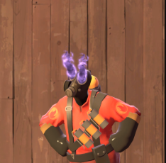
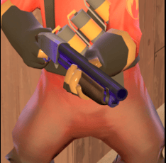
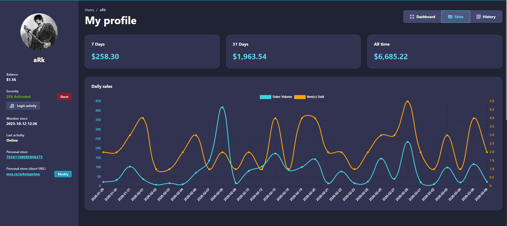
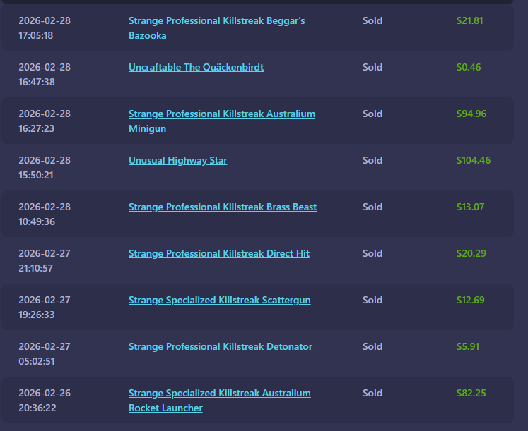
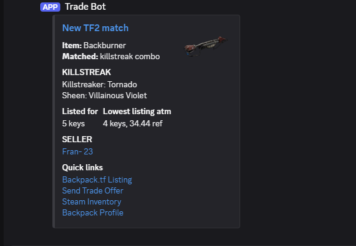

# 🔍 ArkRealDealScrapper

> A personal deal-hunting bot for [backpack.tf](https://backpack.tf/) — built to catch undervalued TF2 killstreak listings before anyone else does.

---

## 💡 What Is This?

**Team Fortress 2** has a player-driven economy where cosmetic weapon upgrades called **Professional Killstreak kits** can be applied to weapons. These kits add visual effects — a glowing eye color (*Killstreaker*) and a sheen that coats your weapon (*Sheen*) — and certain combinations are considered rare or highly desirable.

  

**backpack.tf** is the primary marketplace where players list items for trade. Prices fluctuate constantly and the best deals disappear in minutes.

I built **ArkRealDealScrapper** to do the watching for me.

It runs 24/7 in the background, continuously scanning hundreds of weapon listings across backpack.tf, and **instantly alerts me on Discord** the moment it finds a listing that matches a combo I'm hunting — priced at or below the current market rate.

---

## 💸 Does It Actually Work?

Yes. Here's proof from my backpack.tf seller dashboard:

| Period   | Revenue    |
|----------|------------|
| 7 Days   | $258.30    |
| 31 Days  | $1,963.54  |
| All Time | $6,685.22  |




> These numbers represent real trades — buying underpriced items spotted by this bot and reselling them at market value. After platform fees, the margins are consistent enough to fund a small hobby.

---

## ⚙️ How It Works

The bot is a **.NET 8 Background Service** that runs a continuous scan loop:

```
1. Load target items (items.json) and desired killstreak combos (combos.json)
2. Fetch the live key price from backpack.tf to use as a reference
3. For each item → navigate to its classifieds page (up to N pages)
4. Extract all "sell" listings and their attributes (price, sheen, killstreaker, seller)
5. Check each listing against desired combos and the price threshold (baseline + wiggle %)
6. Skip anything already seen (SeenStore deduplication)
7. Fire a rich Discord embed with quick-action links for any match
8. Wait, jitter, repeat
```

### Architecture

```
DealScannerWorker
├── PlaywrightSession       → Browser automation (Chromium via Playwright)
│   └── ClassifiedsListingExtractor  → DOM scraping of listing attributes
├── KeyPriceService         → Live key price fetching & caching (30 min TTL)
├── JsonFileLoader          → Hot-reloadable items/combos config
├── DiscordWebhookNotifier  → Rich embed alerts with trade links
├── SeenStore               → Persistent deduplication across cycles
└── Core: PriceParser + Models  → Price math (keys + ref → total ref)
```

---

## 🧩 Why Playwright Instead of an API?

backpack.tf's classifieds page is **heavily JavaScript-rendered** — the listing data is injected into the DOM after page load, not present in raw HTML. A simple HTTP request returns nothing useful.

Playwright drives a real Chromium browser, which means:
- Full JS execution and DOM rendering
- Persistent browser profile (survives sessions)
- Cookie injection to authenticate and maintain session
- Partial Cloudflare bypass via `cf_clearance` cookie injection
- Graceful fallback: if a CAPTCHA challenge appears, the bot pauses and prompts you to solve it manually in the open browser window, then resumes automatically

---

## 🎯 What It Scans For

**Items** — configured in `data/items.json`. Currently tracks ~60 weapons, both standard and Australium variants:

> Rocket Launcher, Scattergun, Medi Gun, Knife, Ambassador, Minigun, and many more — including their Australium counterparts where applicable.

**Killstreak Combos** — configured in `data/combos.json`. Example of what I'm currently hunting:

| Sheen              | Killstreaker  |
|--------------------|---------------|
| Team Shine         | Fire Horns    |
| Villainous Violet  | Fire Horns    |
| Hot Rod            | Fire Horns    |
| Manndarin          | Fire Horns    |
| Team Shine         | Tornado       |
| Villainous Violet  | Tornado       |
| Hot Rod            | Tornado       |

Both files are **hot-reloadable** — no restart needed to add new items or combos.

---

## 📣 Discord Alert Example

When a match is found, you get a rich embed like this:



Everything you need to act on a deal is one click away.

---

## 🛠️ Configuration

All settings live in `appsettings.json` and can be overridden per environment:

```json
{
  "Discord": {
    "WebhookUrl": "your-webhook-url",
    "Username": "Trade Bot"
  },
  "Scan": {
    "Pages": 2,
    "WigglePercent": 10.0,
    "DelayMsBetweenPages": 1000,
    "DelayMsBetweenItems": 3000,
    "CycleDelayMs": 150000,
    "JitterPercent": 35,
    "ItemsFile": "data/items.json",
    "CombosFile": "data/combos.json",
    "SeenFile": "data/seen.json"
  }
}
```

| Setting              | Description                                                    |
|----------------------|----------------------------------------------------------------|
| `Pages`              | How many classifieds pages to scan per item                   |
| `WigglePercent`      | How much above the cheapest listing to still consider a deal  |
| `CycleDelayMs`       | How long to wait between full scan cycles                     |
| `JitterPercent`      | Random delay variance to avoid bot-like patterns              |
| `SeenFile`           | Persisted list of already-alerted listing IDs                 |

Set `DISCORD_WEBHOOK_URL` as an environment variable to override the config without editing files.

---

## 🚀 Getting Started

### Prerequisites
- [.NET 8 SDK](https://dotnet.microsoft.com/download)
- [Playwright for .NET](https://playwright.dev/dotnet/docs/intro) (`playwright install chromium`)
- A backpack.tf account (logged in via browser to export cookies)
- A Discord webhook URL

### Setup
```bash
# 1. Clone the repo
git clone https://github.com/yourname/ArkRealDealScrapper.git

# 2. Install Playwright browsers
pwsh bin/Debug/net8.0/playwright.ps1 install chromium

# 3. Export your backpack.tf cookies to:
#    ArkRealDealScrapper.Worker/cookies.backpack.json
#    (use a browser extension like "Cookie-Editor" and export as JSON)

# 4. Update your cf_clearance cookie value in PlaywrightSession.cs
#    (grab it from your browser DevTools after visiting backpack.tf)

# 5. Set your Discord webhook
#    Either in appsettings.Local.json or as environment variable

# 6. Run
dotnet run --project ArkRealDealScrapper.Worker
```

---

## 📁 Project Structure

```
ArkRealDealScrapper.sln
├── ArkRealDealScrapper.Core/
│   ├── Classifieds/ClassifiedsUrlBuilder.cs
│   ├── Logic/PriceParser.cs
│   └── Models/  (SellListingDetails, ItemEntry, DesiredCombo)
├── ArkRealDealScrapper.Infrastructure/
│   ├── BackpackPageWaiter.cs
│   ├── ClassifiedsListingExtractor.cs
│   ├── DiscordWebhookNotifier.cs
│   ├── JsonFileLoader.cs
│   └── KeyPriceService.cs
└── ArkRealDealScrapper.Worker/
    ├── data/
    │   ├── items.json
    │   └── combos.json
    ├── DealScannerWorker.cs
    ├── PlaywrightSession.cs
    ├── SeenStore.cs
    ├── CookieFileLoader.cs
    └── Program.cs
```

---

## ⚠️ Notes

- The `cf_clearance` cookie typically expires every **month** and must be manually refreshed in `PlaywrightSession.cs`
- This tool is built for **personal use** — use responsibly and respect backpack.tf's terms of service
- The bot includes intentional pacing and jitter to avoid hammering the site

---

*Built out of curiosity, refined by profit.*
